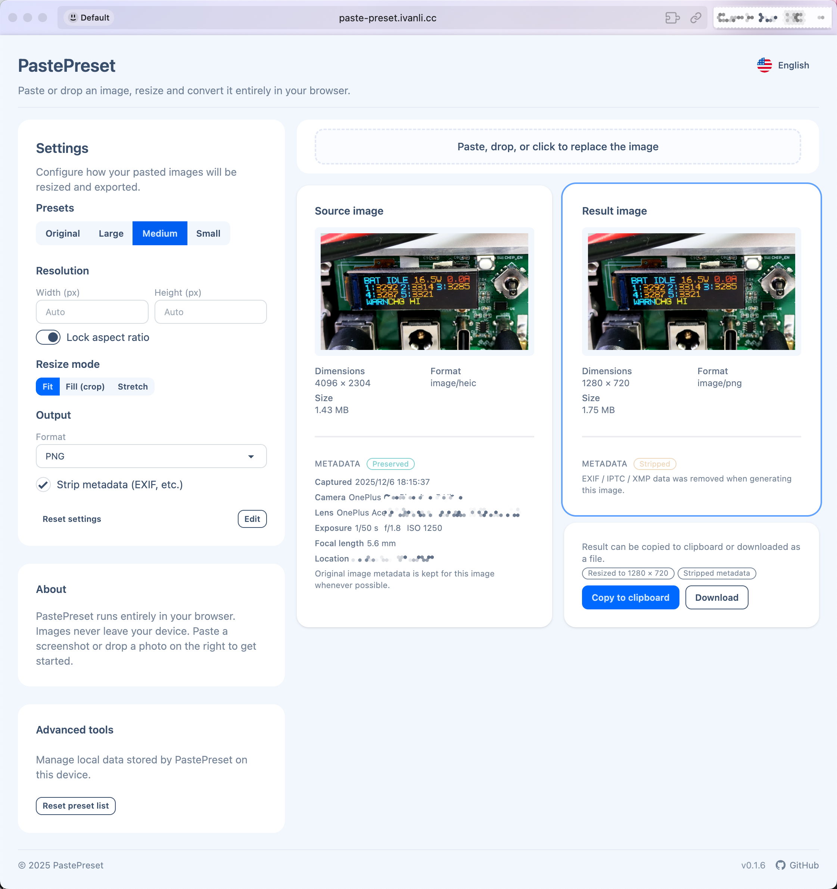

<p align="center">
  
</p>

# PastePreset

[](https://github.com/IvanLi-CN/paste-preset/releases)
[](https://github.com/IvanLi-CN/paste-preset/actions/workflows/ci.yml)
[](https://bun.sh/)
[](https://react.dev/)
[](vite.config.ts)
[](https://tailwindcss.com/)
[](https://daisyui.com/)

PastePreset is a browser-based single-page application for quickly processing screenshots and mobile photos. It lets you crop, resize, transcode, and strip metadata entirely in the browser, then either copy the result to the clipboard or download it locally. No image data ever leaves your machine.



## Features

- 100% client-side image processing (no backend server)
- Crop and resize images
- Format conversion (including HEIC/HEIF to more common formats)
- Control over output quality and size
- Metadata stripping (EXIF, GPS, etc.)
- Copy processed image to clipboard
- Download processed image as a file

## Tech Stack

- React + TypeScript + Vite SPA (dev server on port `25119`)
- Tailwind CSS v4 + DaisyUI for UI components and theming
- Bun (>= 1.0) as runtime and package manager
- Biome for formatting, linting, and unified `check` workflow  
  (replaces ESLint + Prettier)

## Prerequisites

- Bun >= 1.0 installed on your machine

## Development

```bash
bun install
bun run dev
```

The dev server runs at `http://localhost:25119/` by default.

## Scripts (via Bun)

- `bun run dev` – Start the Vite development server.
- `bun run build` – Type-check and build for production into `dist/`.
- `bun run preview` – Preview the production build locally.
- `bun run lint` – Run `biome lint .` for static analysis only (no file changes).
- `bun run format` – Run `biome format --write .` to format code in place.
- `bun run check` – Run `biome check .` for combined formatting, import sorting, and lint checks.

## Release

This repo uses a PR-label-driven release flow. Every PR targeting `main` must carry:

- Exactly one `type:*` label:
  - `type:patch` – Release and bump patch.
  - `type:minor` – Release and bump minor.
  - `type:major` – Release and bump major.
  - `type:docs` – No release.
  - `type:skip` – No release.
- Exactly one `channel:*` label:
  - `channel:stable` – Stable release.
  - `channel:rc` – Prerelease (RC).

On a successful merge to `main`, CI will create a tag + GitHub Release when `type:patch|minor|major` is set:

- Stable: `vX.Y.Z`
- RC: `vX.Y.Z-rc.{sha7}` (marked as a GitHub prerelease)

## Deployment

See `docs/deploy-github-pages.md` for instructions on deploying to GitHub Pages.

## License

This project is distributed under the MIT License. See `LICENSE` for details.
