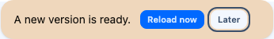
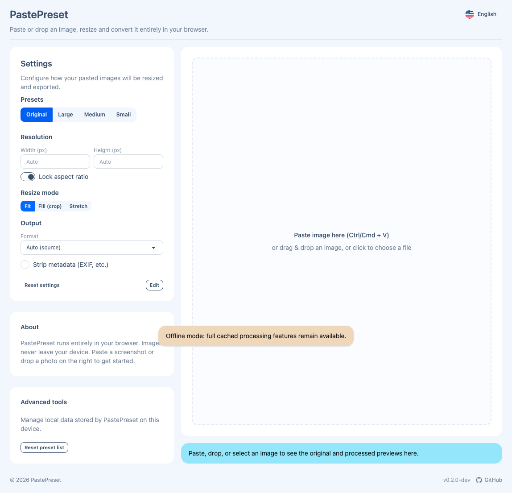

# Offline PWA

## Summary

PastePreset ships as a root-path Progressive Web App that remains usable after
at least one successful online visit. Return visits must prefer the cached app
shell so the interface appears immediately while update checks and optional
heavy-codec warmup continue in the background. The offline contract covers
browser revisit and hard reload for desktop Chromium, with an additional manual
smoke path for installed desktop app launch.

## Goals

### 1. Root-path installability

- Production hosting is the root path `/`, currently
  `https://paste-preset.ivanli.cc/`.
- `manifest.webmanifest`, the service worker scope, and runtime asset loading
  must stay aligned with `/`.
- Installability relies on browser-native install entry points; the app does
  not add a custom `beforeinstallprompt` CTA.

### 2. Offline revisit and hard reload

- After a successful online visit, reopening `/` while offline or on a weak
  network must render the cached shell immediately without waiting on a
  navigation network round-trip.
- The cached shell must show the full UI without missing styles, icons, or
  version metadata.
- The common offline flow remains available after the cached shell loads:
  import image -> process locally -> download result.
- Advanced offline formats (HEIC and animated codec helpers) may finish in a
  second phase after background warmup succeeds online once.
- Desktop Chromium is the strict automated target. Installed standalone launch
  on desktop remains a manual smoke requirement tied to the same artifact set.

### 3. Waiting-update lifecycle

- Updated service workers must not take over automatically.
- When a new worker reaches `waiting`, the UI shows a sticky status message with
  `Reload now` and `Later`.
- `Later` only dismisses the current waiting worker prompt for the current page
  session.
- `Reload now` posts `SKIP_WAITING` to the waiting worker and reloads only
  after `controllerchange`.
- If another tab explicitly activates the waiting worker, tabs that already
  know they are behind may self-refresh on `controllerchange` to avoid mixed
  old-page/new-worker asset sets.

### 4. Offline UX feedback

- A subtle offline status is visible while the browser is offline so users can
  distinguish cached-mode behavior from failures.
- The offline status distinguishes between cached shell readiness and full
  offline readiness for advanced formats.
- External links remain clickable; the offline signal is informational and does
  not alter footer link behavior.

## Non-goals

- First-launch offline support without any successful online visit.
- Mandatory Android/iOS release gating in this topic. Mobile platforms stay in
  manual-check territory with explicit caveats.
- Caching pasted files, generated outputs, or any remote account/state data.
- Push notifications, background sync, or cloud-connected PWA features.

## Constraints

### Hosting and asset contract

- The Vite base path is `/`.
- `version.json` must exist before the service worker precache manifest is
  generated.
- UI assets must be bundled locally; no runtime CDN dependency is allowed for
  icons, fonts, or styles.

### Service worker contract

- The service worker precaches the built cached app shell, `version.json`,
  icons, the main worker, and common processing assets.
- Optional heavy codec assets are listed in `offline-warm-manifest.json` and
  cached later through background warmup.
- Once a cached shell exists, SPA navigation requests prefer cached
  `index.html` immediately instead of waiting for the network.
- Automatic `skipWaiting()` during install and automatic `clients.claim()` are
  forbidden for this topic.
- The worker may still honor a `SKIP_WAITING` message that originates from an
  explicit UI action.

## Acceptance

### Automated acceptance

- `bun run check`
- `bun run build`
- `bun run test`
- `bun run test:e2e:pwa`
- Storybook coverage for the reusable `StatusBar` states that expose offline and
  waiting-update UX

### Observable behavior

- Offline revisit or hard reload of `/` shows the cached shell and version
  footer, with `app-shell-visible <= 1s` and `app-interactive <= 2s` in the
  controlled preview environment.
- Offline processing and download succeed for a representative fixture image.
- The runtime can reach `full offline-ready` online without blocking startup.
- Offline HEIC without completed warmup explains that one successful online
  warmup is still required.
- A waiting service worker does not interrupt the current session until the user
  clicks `Reload now`.
- The status UI can represent:
  - idle hidden state
  - processing
  - errors
  - offline shell-ready state
  - offline full-ready state
  - warmup retry hint
  - update available with actions
  - update applying state

## Visual Evidence

PR: include

- Waiting-update prompt rendered through the reusable `StatusBar` story on the
  current reviewed `HEAD`.

  

- Root-path production preview rendered in desktop Chromium while offline,
  showing the cached shell, offline notice, and footer version on the current
  reviewed `HEAD`.

  

## References

- Legacy source draft: [docs/pwa-offline-support.md](../../pwa-offline-support.md)
- Deployment guide: [docs/deploy-github-pages.md](../../deploy-github-pages.md)
- README project entry: [README.md](../../../README.md)
